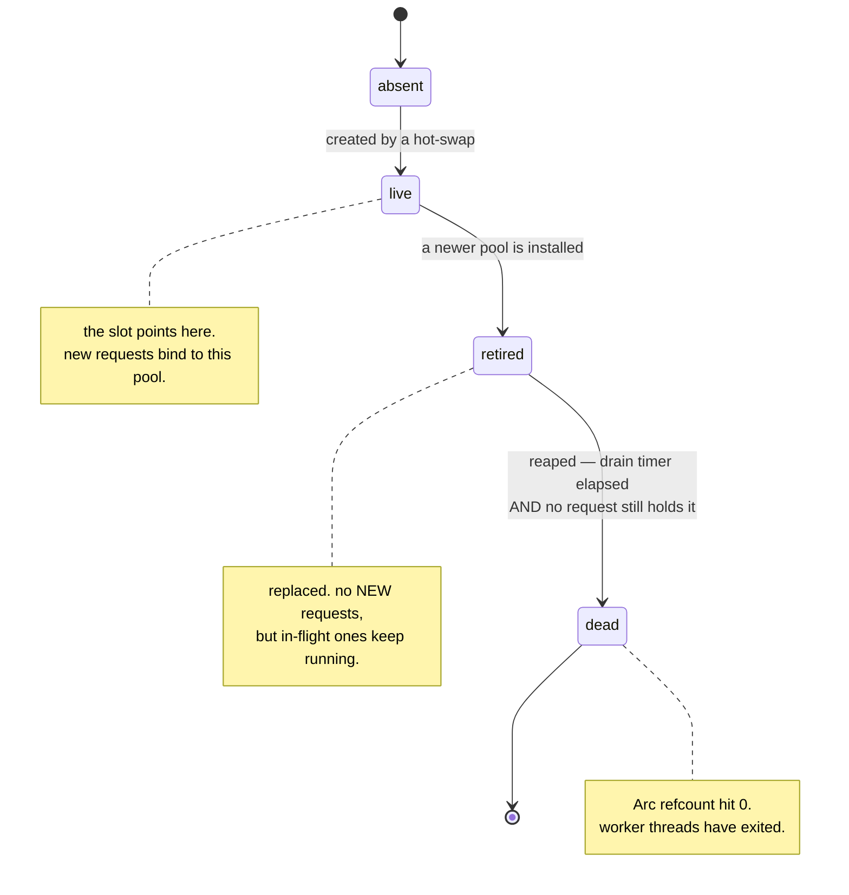
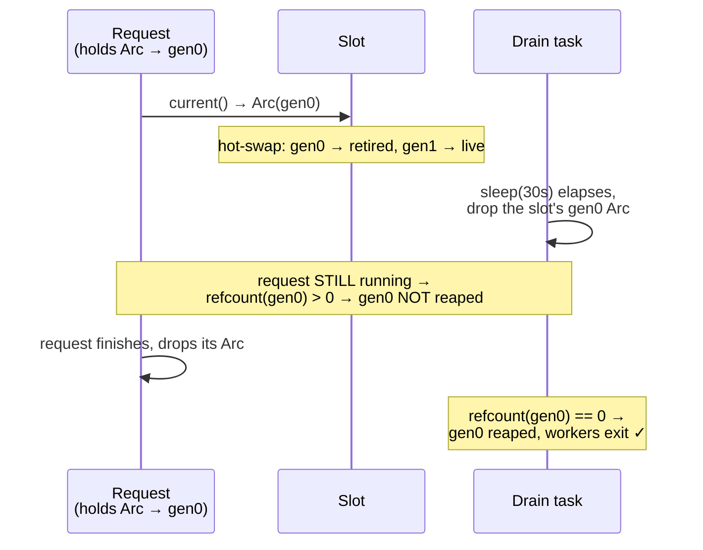
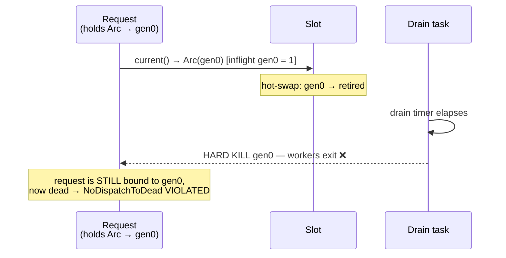
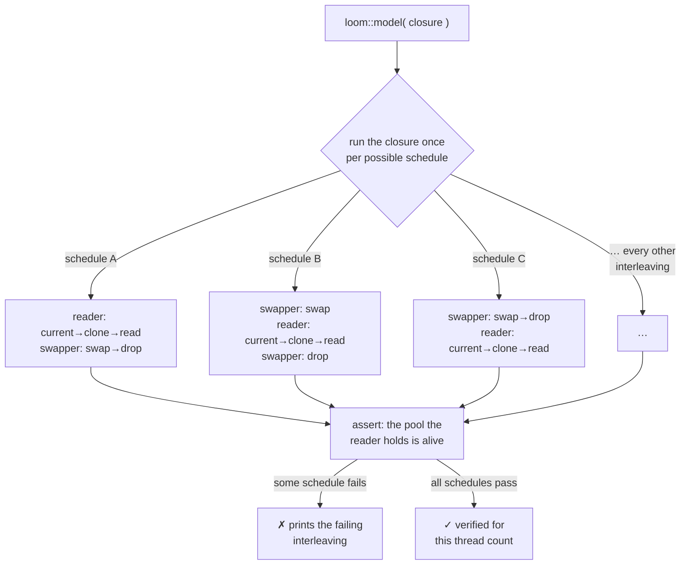
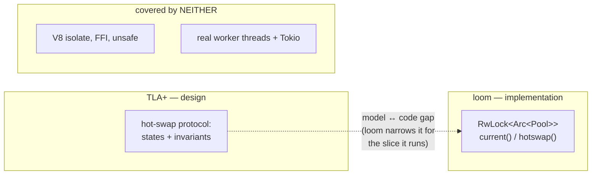

# Visual guide to the TLA+ and loom checks

A picture-first companion to [README.md](README.md). Everything here is about the
one protocol both tools target: the sliver hot-swap in `SliverPoolSlot`.

---

## 1. The mental model: a pool's life

Both tools reason about a worker pool moving through four states. A **request**
binds to whatever pool the slot points at when it calls `current()`, and holds it
(an `Arc`) until the request finishes.



The whole correctness question is the `retired → dead` arrow: **when is it safe to
tear a pool down?** The shipped design says "only when nobody is still using it."

---

## 2. Why the design is safe (shipped: wait for the refcount)

A slow request is still running when the 30s drain timer fires. Because the request
holds its own `Arc` clone, the pool is *not* dropped — its workers stay alive until
that last request finishes.



`NoDispatchToDead` holds: the request was never bound to a dead pool.

---

## 3. Why the "obvious" alternative is a bug (hard-kill on the timer)

If instead you tear the pool down the moment the drain timer fires — ignoring
whether requests still hold it — you get a dropped request. This is the exact
5-state trace TLC printed for `HardKill = TRUE`:



TLC as states (what `make tla-counterexample` prints):

```
State 1  slot=0  status=[0:live]                       inflight=[0:0]
State 2  slot=0  status=[0:live]                       inflight=[0:1]   ← Dispatch
State 3  slot=1  status=[0:retired, 1:live]            inflight=[0:1]   ← HotSwap
State 4  slot=1  status=[0:retired, 1:live] drained={0} inflight=[0:1]  ← DrainElapse
State 5  slot=1  status=[0:DEAD,    1:live] drained={0} inflight=[0:1]  ← Reap  ✗
                          ▲                              ▲
                   pool is dead                 but a request is still on it
```

That contradiction is what "TLA+ found a bug" looks like: a concrete, minimal
sequence of steps that reaches a bad state.

---

## 4. What loom does differently

TLA+ reasons about the *model* above. loom runs the **actual Rust** and tries
*every possible interleaving* of the two threads plus every legal memory ordering.
Conceptually:



The same two threads, drawn as a timeline loom permutes. The **read** must always
land on a live pool no matter where the swap/drop slots in:

```
 time ─────────────────────────────────────────────▶

 reader :   current() ──clone(gen0)── read.alive? ── drop
 swapper:            swap(gen1) ── drop(old gen0 Arc)

 loom slides the swapper's steps into EVERY gap of the reader's timeline
 (and vice-versa), for all memory orderings, and checks the assertion each time.
```

Because the reader holds an `Arc`, `drop(old)` can't reach refcount 0 while the
reader is between `clone` and `read` — so `read.alive?` is always true. loom
proves there is no schedule where that breaks. (`hard_kill_variant_is_caught_by_loom`
removes that protection and loom immediately finds the broken schedule.)

---

## 5. What each tool covers — and what neither does



- **TLA+** tells you the *plan* is correct — but not that the code follows the plan.
- **loom** tells you the *lock/Arc code* follows the plan — but only for the small
  skeleton it runs, with a stub pool.
- **Neither** touches V8, the FFI, `unsafe`, or the actual OS threads/Tokio. Those
  stay the domain of ordinary tests, Miri (for `unsafe`), and review.

Two sharp checks on one protocol — not a whole-system proof.
